# RTOS Layers
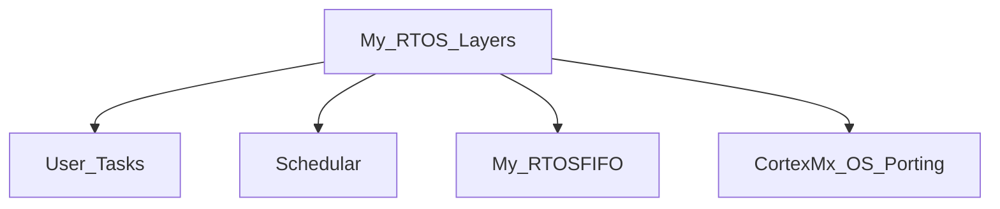

## User Tasks
The user should write the tasks that he needs to execute them.
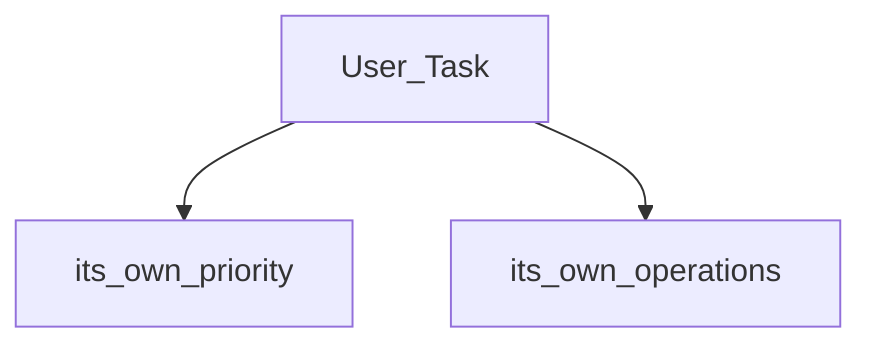

## Scheduler
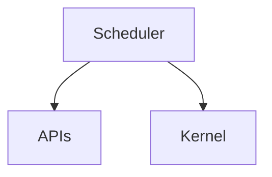

### APIs
This APIs that will provide to the user and it can use them to treat with tasks.
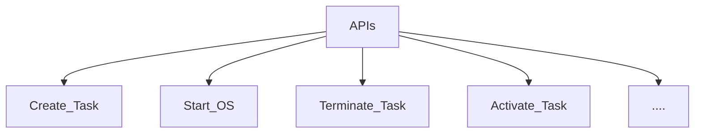

### Kernel

It will contain #the_scheduling_algorithm.

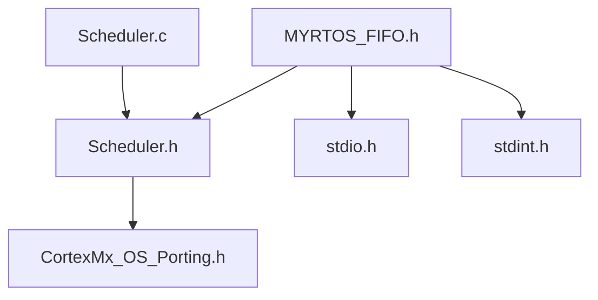

## My RTOS FIFO
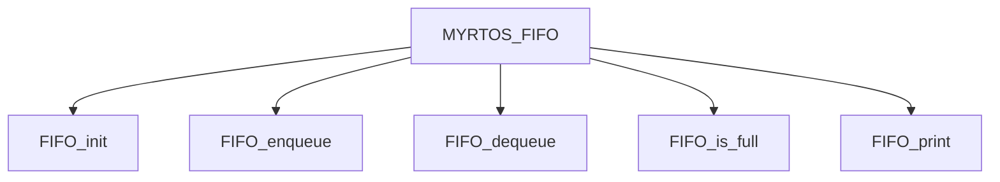

## Porting
It will contain all things about CPU and SOC and if we change the CPU or SOC we should change the code in this file but we should fix the APIs of this file.

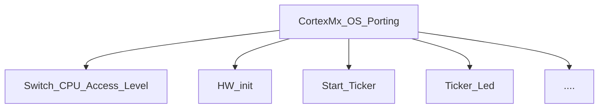
___
# Tasks States

## Suspend State
* if we create a task it will enter suspend state.
* if we terminate a task it will enter suspend state.
* if we acquire a mutex and this mutex is taken by anthor task then our task will enter suspend state.

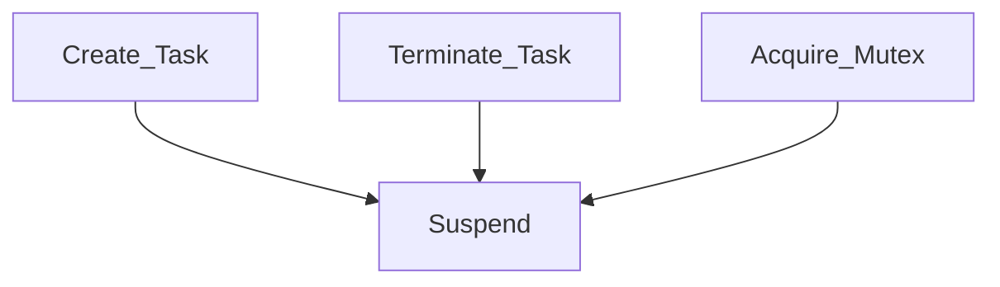
## Waiting State
* if we activate a task it will enter waiting state.
* if we acquire a mutex and this mutex is released then this task will enter waiting state.
* if we are in running state but anthor task in preempt us because it's high priority then our task will enter waiting state.

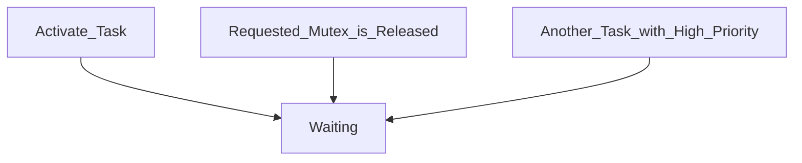
## Ready State
* if we are in waiting state but we have the highest priority then we enter ready state.
* if we have the same priority with another task then we enter the ready state when the another task is running for time slice.

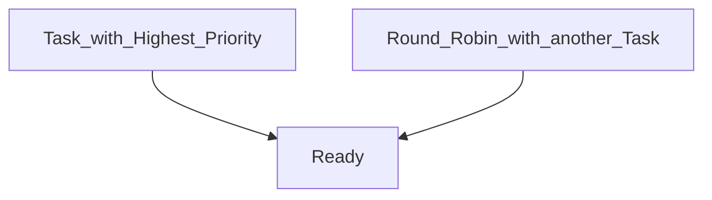

## Running State
* if we have the same priority with another task then we enter the running state when the another task is in ready state for time slice.
* if we are in ready state and we have the highest priority then we enter running state.

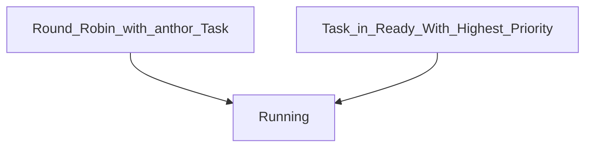

## Conclusion 

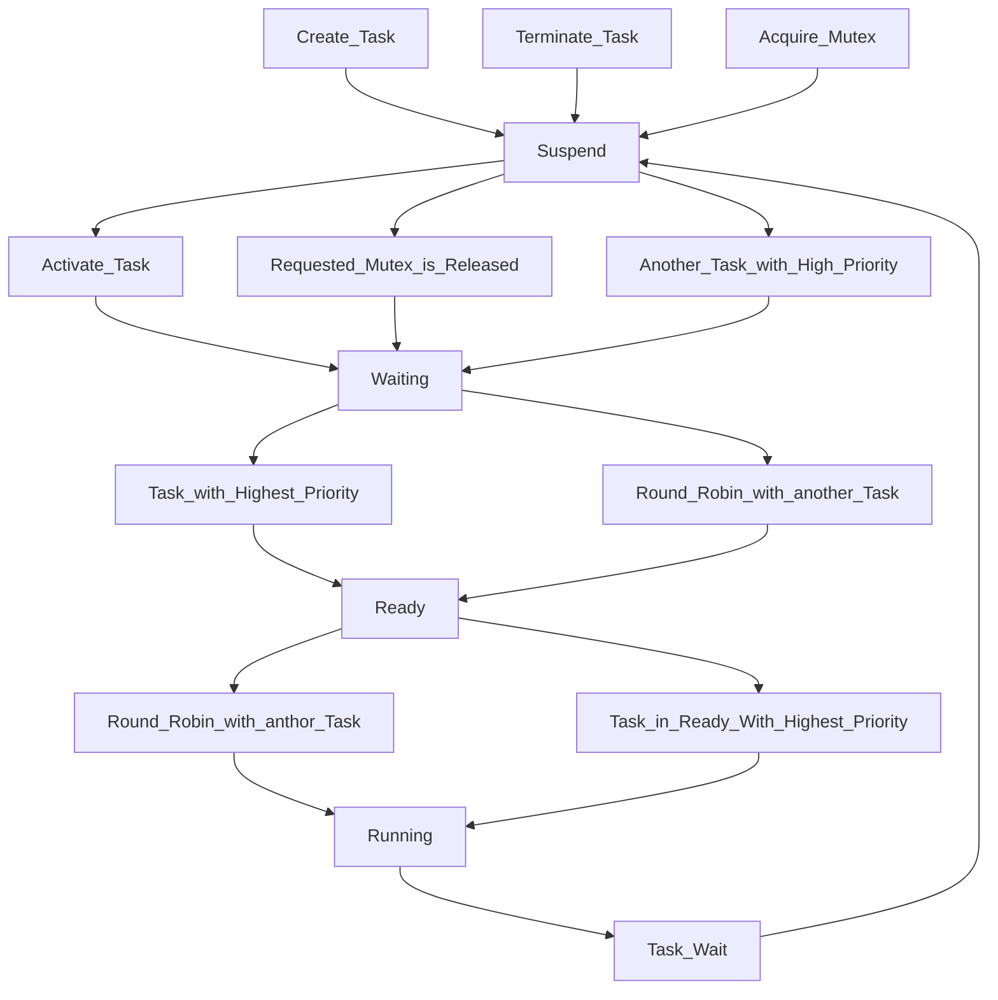

| Tasks |                      |                      |
| ----- | -------------------- | -------------------- |
|       | Task Tables          | Ready Queue          |
|       | ![[Task Tables.png]] | ![[Ready Queue.png]] |
___
# Hardware Initialize
we initialize CPU clock and  SysTick Timer clock
it will be by default 8 MHz
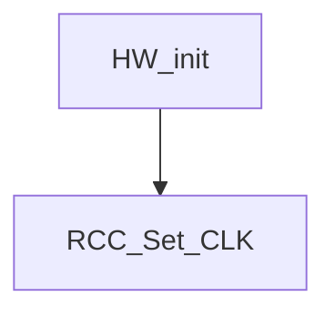

___
# My RTOS Initialize
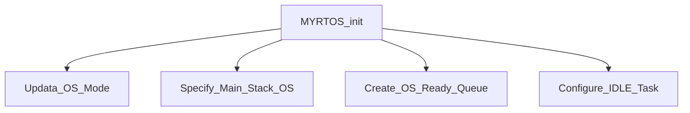

